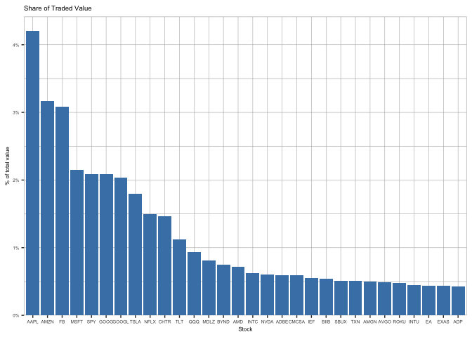

01\_parse\_itch\_order\_flow\_messages
================
Mayan
5/28/2021

## Working with Order Book Data: NASDAQ ITCH

There is an R package called [RITCH](https://github.com/DavZim/RITCH)
created by DavZim which processes the ITCH binary files. Therefore, much
of the work done by Jansen in this section is done for free (yay!).

## Imports

## Get NASDAQ ITCH Data from FTP Server

(Jansen:) The Nasdaq offers samples of daily binary files for several
months.

We are now going to illustrates how to parse a sample file of ITCH
messages and reconstruct both the executed trades and the order book for
any given tick.

The data is fairly large and running the entire example can take a lot
of time and require substantial memory (16GB+). Also, the sample file
used in this example may no longer be available because NASDAQ
occasionaly updates the sample files.

### Set Data Paths

These will be set to the working directory

``` r
# Set working directory
setwd("~/Desktop/MLFAT_R/Machine-Learning-for-Algorithmic-Trading-R/02_market_and_fundamental_data/01_NASDAQ_TotalView-ITCH_Order_Book")

# Define file path
datapath = '~/Desktop/MLFAT_R/'
datapath2 = '~/Desktop/MLFAT_R/data'
```

### Download & unzip

While the below code should work, I found that dragging and dropping the
ITCH50.gz file directly from the [ftp
server](ftp://emi.nasdaq.com/ITCH/) was much faster. Likewise, unzipping
through my OS seemed to be more reliable.

``` r
# URL for data download
FTP_URL = 'ftp://emi.nasdaq.com/ITCH/'
SOURCE_FILE = '10302019.NASDAQ_ITCH50.gz'
uname = paste(FTP_URL, SOURCE_FILE, sep = "")
```

This function will check your working director (set earlier) to see if
the data directory and ITCH files are present. If not they are created

``` r
# Set timeout to 1000 seconds
options(timeout=10000)
may_be_download = function(url) 
{
  # Download and unzip ITCH data if not yet available
  if(!"data" %in% list.files(datapath)) {
    print("Creating directory")
    dir.create(datapath)
  } else {
    print("Directory Exists")
  }
  # Splits url string to retrieve file name
  splt_url = tail(unlist(str_split(url, pattern = "/")),n=1)[1]
  filename = paste(datapath2, splt_url, sep = "/")
  if(!splt_url %in% list.files(datapath))
  {
    print(paste("Downloading...", url))
    # Download File

    download.file(url,filename)
  } else {
    print("File exists")
  }
  
  # gets file stem without extension and creates .bin file path
  file_only = tools::file_path_sans_ext(splt_url)
  unzipped = paste(datapath2, file_only, sep = "/")
  if(!file_only %in% list.files(datapath2)){
    print(paste("Unzipping to", datapath2))
    gunzip(filename, unzipped, remove=FALSE)
  } else {
    print("File already unpacked")
  }
  return(unzipped)
}
```

This will download 3.87GB data that unzips to 9.04GB. As noted,
downloading this file takes a while- longer than 15 minutes. I opted to
go to the ftp site and drag and drop it into the directory which copied
over faster.

``` r
file_name = may_be_download(paste(FTP_URL, SOURCE_FILE, sep = "/"))
```

    ## [1] "Directory Exists"
    ## [1] "File exists"
    ## [1] "File already unpacked"

``` r
date = unlist(str_split(SOURCE_FILE, pattern = "."))[1]
```

## Using RITCH package

There is a whole section on creating the formatting and mapping
structures to parse the ITCH file. Since RITCH does most of this for
you, it is bypassed here, and we just show how the package can be used
to get the summary and plot that appear in the book.

*Installing RITCH:* see the [github
repo](https://github.com/DavZim/RITCH) for installation directions.

``` r
library(RITCH)
# This counts messages
msg_count = count_messages(file_name, add_meta_data = TRUE, quiet = TRUE)
head(msg_count)
```

    ##    msg_type  count                 msg_class                    msg_name
    ## 1:        S      6             system_events        System Event Message
    ## 2:        R   8887           stock_directory             Stock Directory
    ## 3:        H   8897            trading_status        Stock Trading Action
    ## 4:        Y   9025                   reg_sho         Reg SHO Restriction
    ## 5:        L 214865 market_participant_states Market Participant Position
    ## 6:        V      1                      mwcb  MWCB Decline Level Message
    ##     doc_nr
    ## 1:     4.1
    ## 2:   4.2.1
    ## 3:   4.2.2
    ## 4:   4.2.3
    ## 5:   4.2.4
    ## 6: 4.2.5.1

Now we can summarize message counts as is done in the text. We actually
get more data using the ‘add\_meta\_data’ and ‘quiet’ options. *Note:*
the data frame produced by count\_messages has missing row names. This
causes issues for dplyr functions. The below fixes this

``` r
row.names(msg_count) = (1:nrow(msg_count))
```

We can now display the data as it appears in the text

``` r
msg_count_summary = msg_count %>% select(msg_type, msg_class, msg_name, count) %>% arrange(desc(count))
msg_count_summary
```

    ##     msg_type                 msg_class
    ##  1:        A                    orders
    ##  2:        D             modifications
    ##  3:        U             modifications
    ##  4:        E             modifications
    ##  5:        I                      noii
    ##  6:        X             modifications
    ##  7:        P                    trades
    ##  8:        F                    orders
    ##  9:        L market_participant_states
    ## 10:        C             modifications
    ## 11:        Q                    trades
    ## 12:        Y                   reg_sho
    ## 13:        H            trading_status
    ## 14:        R           stock_directory
    ## 15:        S             system_events
    ## 16:        J                      luld
    ## 17:        V                      mwcb
    ## 18:        B                    trades
    ## 19:        W                      mwcb
    ## 20:        K                       ipo
    ## 21:        h            trading_status
    ## 22:        N                      rpii
    ##     msg_type                 msg_class
    ##                                      msg_name     count
    ##  1:                         Add Order Message 127214649
    ##  2:                      Order Delete Message 123296742
    ##  3:                     Order Replace Message  25513651
    ##  4:                    Order Executed Message   7316703
    ##  5:                              NOII Message   3740140
    ##  6:                      Order Cancel Message   3568735
    ##  7:                 Trade Message (Non-Cross)   1525363
    ##  8:      Add Order - MPID Attribution Message   1423908
    ##  9:               Market Participant Position    214865
    ## 10: Order Executed Message With Price Message    129729
    ## 11:                       Cross Trade Message     17775
    ## 12:                       Reg SHO Restriction      9025
    ## 13:                      Stock Trading Action      8897
    ## 14:                           Stock Directory      8887
    ## 15:                      System Event Message         6
    ## 16:                       LULD Auction Collar         2
    ## 17:                MWCB Decline Level Message         1
    ## 18:                      Broken Trade Message         1
    ## 19:                       MWCB Status Message         0
    ## 20:                 IPO Quoting Period Update         0
    ## 21:                          Operational Halt         0
    ## 22:                   Retail Interest Message         0
    ##                                      msg_name     count

``` r
trades = read_trades(file_name, quiet = TRUE)
trades = trades %>% mutate(value = price * shares)
trades = trades %>% mutate(value_share = value/sum(value, na.rm = TRUE))
trade_summary = trades %>% group_by(stock) %>% summarise(share_traded = sum(value_share, na.rm = TRUE), .groups='drop') %>%                                arrange(desc(share_traded))

head(trade_summary)
```

    ## # A tibble: 6 x 2
    ##   stock share_traded
    ##   <chr>        <dbl>
    ## 1 AAPL        0.0421
    ## 2 AMZN        0.0317
    ## 3 FB          0.0309
    ## 4 MSFT        0.0215
    ## 5 SPY         0.0209
    ## 6 GOOG        0.0208

``` r
(ggplot(data = head(trade_summary,30), aes(x = reorder(stock, -share_traded), y = share_traded)) 
  + geom_bar(stat="identity", fill="steelblue") 
  + theme(text = element_text(size = 6), 
          panel.background = element_rect(fill='white', colour = 'grey'), 
          panel.grid.major = element_line(colour = "grey70", size = 0.2),
          panel.grid.minor = element_line(colour = "grey70", size = 0.2))
  + ggtitle("Share of Traded Value")
  + xlab("Stock")
  + ylab("% of total value")
  + scale_y_continuous(labels = scales::percent_format(accuracy = 1), expand = expansion(mult=c(0,.05)))
  
 )
```

<!-- -->
